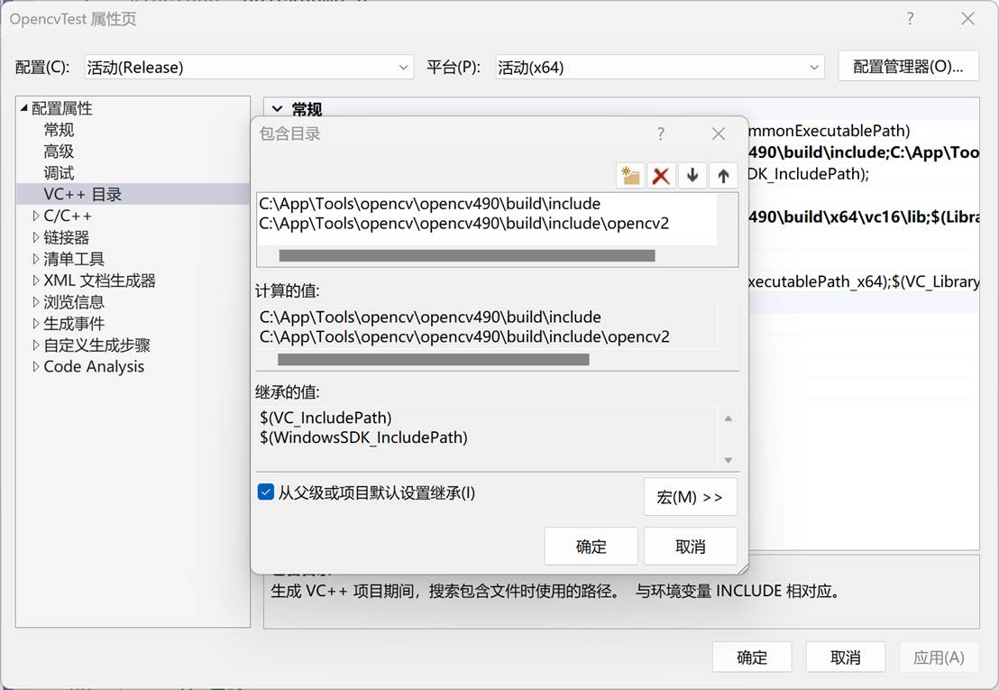
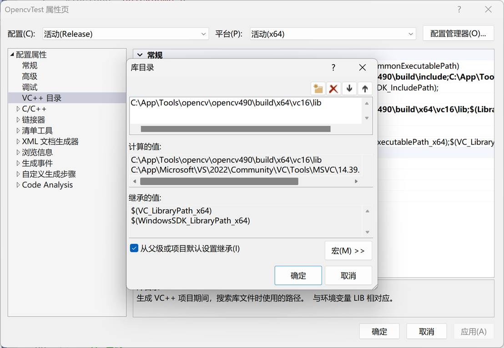
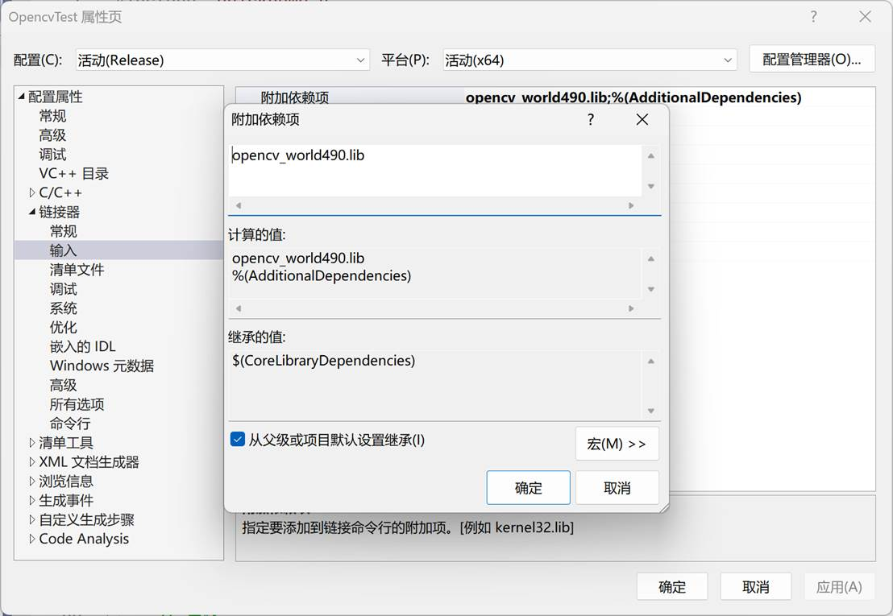

<!--
 * @FilePath: README.md
 * @Author: ModestWang 1598593280@qq.com
 * @Date: 2024-03-12 10:33:29
 * @LastEditors: ModestWang
 * @LastEditTime: 2024-03-12 10:34:38
 * 2024 by ModestWang, All Rights Reserved.
 * @Descripttion: 
-->

Read Me First.

**安装OpenCV：**

​	官方Github:https://github.com/opencv/opencv/releases/download/4.9.0/opencv-4.9.0-windows.exe

​	加速下载地址：https://github.moeyy.xyz/https://github.com/opencv/opencv/releases/download/4.9.0/opencv-4.9.0-windows.exe

**然后添加环境变量：**

在VS项目属性中要添加的：

注意： debug模式选择：opencv_world490d.lib

​          Release模式选择：opencv_world490.lib
